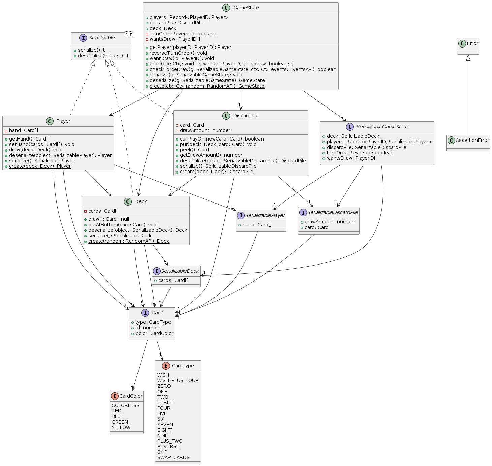

# dos

## Spielregeln

Siehe [Spielregeln](./docs/Spielregeln.md)

## Schichten

Siehe https://excalidraw.com/#json=W_WyAL37bQD7EtzFLYDov,WP0yyRkVU8v42yDcE4pqYA

## Klassendiagramm

## Verwendete Bibliotheken (und Tools)

- [Git](./docs/Architektur/Bibliotheken%20und%20Tools/Git.md)
- [Node](./docs/Architektur/Bibliotheken%20und%20Tools/Node.md)
- [pnpm](./docs/Architektur/Bibliotheken%20und%20Tools/pnpm.md)
- [Vite](./docs/Architektur/Bibliotheken%20und%20Tools/Vite.md)
- [Typescript](./docs/Architektur/Bibliotheken%20und%20Tools/Typescript.md)
- [Tailwind](./docs/Architektur/Bibliotheken%20und%20Tools/TailwindCSS.md)
- [React](./docs/Architektur/Bibliotheken%20und%20Tools/React.md)
- [Boardgame.io](./docs/Architektur/Bibliotheken%20und%20Tools/Boardgame.io.md)

## Dateistruktur

Siehe [Dateistruktur](./docs/Architektur/Dateistruktur.md)

## Programmablauf

Siehe [Programmablauf](./docs/Architektur/Programmablauf.md)

